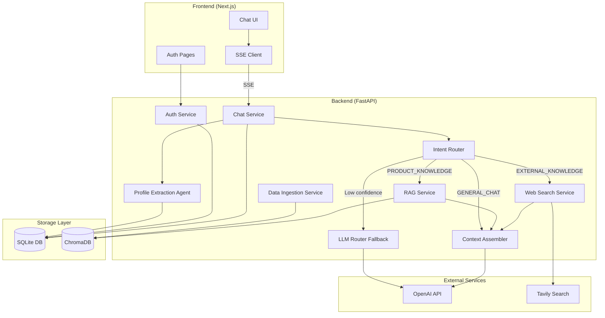
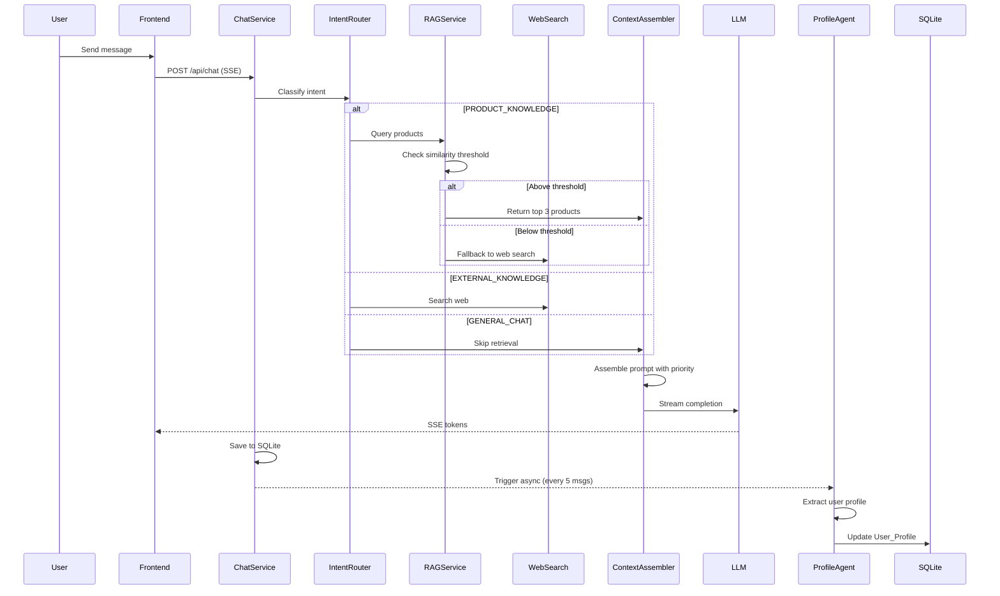

# Design Document: SkinTech AI Consultant

## Overview

SkinTech AI Consultant 是一个全栈智能美妆顾问应用，采用前后端分离架构。前端使用 Next.js + Tailwind CSS 构建现代化聊天界面，后端使用 Python FastAPI 处理业务逻辑和 AI 编排。系统核心是一个具有"配方师"人设的 RAG Agent，能够基于本地知识库和网络搜索为用户提供个性化护肤建议。

### Key Design Decisions

1. **SSE 流式响应** - 使用 Server-Sent Events 实现打字机效果，提升用户体验
2. **双层意图路由** - 关键词匹配 + LLM Fallback，避免无效检索和上下文污染
3. **异步 Profile 提取** - 用户画像提取在后台异步执行，不阻塞主对话流程
4. **Token 预算管理** - 明确的上下文优先级策略，确保关键信息不被截断
5. **SQLite WAL 模式** - 开启 Write-Ahead Logging 支持并发读写
6. **HttpOnly Cookie 认证** - Token 通过安全 Cookie 传输，防止 XSS 攻击

## Architecture



### Request Flow



## Components and Interfaces

### Frontend Components

#### 1. ChatLayout
主布局组件，包含侧边栏和聊天区域。

```typescript
interface ChatLayoutProps {
  children: React.ReactNode;
}
```

#### 2. Sidebar
显示对话历史列表和用户设置。

```typescript
interface SidebarProps {
  conversations: Conversation[];
  activeConversationId: string | null;
  onSelectConversation: (id: string) => void;
  onNewConversation: () => void;
  onLogout: () => void;
}

interface Conversation {
  id: string;
  title: string;
  updatedAt: Date;
}
```

#### 3. ChatArea
主聊天区域，显示消息列表和输入框。

```typescript
interface ChatAreaProps {
  messages: Message[];
  isLoading: boolean;
  onSendMessage: (content: string) => void;
}

interface Message {
  id: string;
  role: 'user' | 'assistant';
  content: string;
  timestamp: Date;
  sources?: Source[];  // For RAG/Web search citations
}

interface Source {
  type: 'product' | 'web';
  title: string;
  url?: string;
}
```

#### 4. MessageBubble
单条消息气泡，支持 Markdown 渲染。

```typescript
interface MessageBubbleProps {
  message: Message;
}
```

#### 5. SSEClient Hook
处理 SSE 流式响应的自定义 Hook。

```typescript
interface UseSSEChatOptions {
  onToken: (token: string) => void;
  onComplete: (message: Message) => void;
  onError: (error: Error) => void;
}

function useSSEChat(options: UseSSEChatOptions): {
  sendMessage: (content: string) => void;
  isStreaming: boolean;
  abort: () => void;
};
```

### Backend Services

#### 1. AuthService
处理用户认证逻辑。

```python
class AuthService:
    async def register(self, username: str, password: str) -> User:
        """Register a new user with hashed password."""
        pass
    
    async def login(self, username: str, password: str) -> TokenResponse:
        """Authenticate user and return JWT token."""
        pass
    
    async def logout(self, token: str) -> None:
        """Invalidate the current session token."""
        pass
    
    async def verify_token(self, token: str) -> User:
        """Verify JWT token and return user."""
        pass
```

#### 2. IntentRouter
双层意图分类器：关键词匹配 + LLM Fallback。

```python
class IntentType(Enum):
    PRODUCT_KNOWLEDGE = "product_knowledge"
    GENERAL_CHAT = "general_chat"
    EXTERNAL_KNOWLEDGE = "external_knowledge"

class IntentResult(BaseModel):
    intent: IntentType
    confidence: float  # 0.0 - 1.0
    used_llm_fallback: bool

class IntentRouter:
    CONFIDENCE_THRESHOLD = 0.6  # Below this, use LLM fallback
    
    # Keyword patterns
    PRODUCT_KEYWORDS = ["推荐", "成分", "护肤品", "面霜", "精华", "乳液", "防晒", "美白", "抗老", "祛痘"]
    EXTERNAL_KEYWORDS = ["最新", "2025", "新品", "趋势", "新闻", "发布"]
    
    def classify(self, query: str) -> IntentResult:
        """
        Two-layer intent classification:
        1. Keyword matching with confidence scoring
        2. LLM fallback if confidence < threshold
        """
        pass
    
    async def _llm_classify(self, query: str) -> IntentType:
        """
        Use lightweight LLM (gpt-4o-mini, temperature=0) for classification.
        Prompt: "Classify this skincare query into: PRODUCT_KNOWLEDGE, GENERAL_CHAT, or EXTERNAL_KNOWLEDGE"
        """
        pass
```

#### 3. RAGService
RAG 检索服务。

```python
class RAGService:
    def __init__(self, chroma_client: ChromaDB, similarity_threshold: float = 0.7):
        self.chroma = chroma_client
        self.threshold = similarity_threshold
    
    async def retrieve(self, query: str, top_k: int = 3) -> RAGResult:
        """
        Query ChromaDB and return products above similarity threshold.
        Returns empty list if no results meet threshold.
        """
        pass

class RAGResult:
    products: list[Product]
    max_similarity: float
    below_threshold: bool
```

#### 4. WebSearchService
网络搜索服务。

```python
class WebSearchService:
    async def search(self, query: str, max_results: int = 3) -> list[SearchResult]:
        """Search web using Tavily API."""
        pass

class SearchResult:
    title: str
    url: str
    snippet: str
```

#### 5. ContextAssembler
上下文组装器，管理 Token 预算。

```python
class ContextAssembler:
    PRIORITY_ORDER = [
        "system_prompt",      # Highest priority
        "current_query",
        "rag_context",
        "user_profile",
        "short_term_memory",  # Lowest priority
    ]
    
    def assemble(
        self,
        system_prompt: str,
        current_query: str,
        rag_context: list[Product] | None,
        user_profile: UserProfile | None,
        chat_history: list[Message],
        max_tokens: int = 4096
    ) -> list[dict]:
        """
        Assemble prompt components respecting token budget.
        Truncates from lowest priority (short_term_memory) first.
        """
        pass
```

#### 6. ProfileExtractionAgent
异步用户画像提取 Agent。

```python
class ProfileExtractionAgent:
    async def extract(self, user_id: str, messages: list[Message]) -> UserProfile:
        """
        Analyze conversation history and extract structured user profile.
        Runs asynchronously in background.
        """
        pass
    
    async def update_profile(self, user_id: str, profile: UserProfile) -> None:
        """
        Atomically update user profile in database.
        Uses transaction to prevent race conditions.
        """
        pass
```

#### 7. ChatService
主聊天服务，协调所有组件。

```python
class ChatService:
    async def chat(
        self,
        user_id: str,
        message: str,
        conversation_id: str | None = None
    ) -> AsyncGenerator[str, None]:
        """
        Process chat message and stream response via SSE.
        
        Flow:
        1. Classify intent
        2. Retrieve context (RAG or Web Search)
        3. Assemble prompt with token budget
        4. Stream LLM response
        5. Save to database
        6. Trigger profile extraction if needed
        """
        pass

#### 8. IngestionService
数据摄入服务，负责产品数据的生成和向量化。

```python
class IngestionService:
    def __init__(self, chroma_client: ChromaDB, embedding_model: str = "text-embedding-3-small"):
        self.chroma = chroma_client
        self.embedding_model = embedding_model
    
    def generate_products(self, count: int = 5000) -> list[Product]:
        """
        Generate mock skincare product data using Faker + predefined templates.
        Returns list of Product objects.
        """
        pass
    
    def format_for_embedding(self, product: Product) -> str:
        """
        Format product into standardized text template for embedding.
        Template: "Product: {name}, Brand: {brand}, Contains: {ingredients}..."
        """
        pass
    
    async def ingest(self, products: list[Product]) -> int:
        """
        Vectorize products and upsert to ChromaDB.
        Returns count of successfully ingested products.
        """
        pass
    
    def save_to_json(self, products: list[Product], filepath: str = "products_data.json") -> None:
        """Save generated products to JSON file for backup/inspection."""
        pass
```

### Database Configuration

```python
# SQLite Configuration for concurrent access
DATABASE_CONFIG = {
    "url": "sqlite+aiosqlite:///./skintech.db",
    "connect_args": {
        "check_same_thread": False,
    },
    "pool_pre_ping": True,
}

# Enable WAL mode on connection
async def configure_sqlite(connection):
    await connection.execute("PRAGMA journal_mode=WAL")
    await connection.execute("PRAGMA synchronous=NORMAL")
    await connection.execute("PRAGMA busy_timeout=5000")

# ChromaDB Configuration (persistent local storage)
CHROMA_CONFIG = {
    "persist_directory": "./chroma_db",
    "collection_name": "skincare_products",
}
```

## Data Models

### SQLite Schema

```sql
-- Users table
CREATE TABLE users (
    id TEXT PRIMARY KEY,
    username TEXT UNIQUE NOT NULL,
    password_hash TEXT NOT NULL,
    created_at TIMESTAMP DEFAULT CURRENT_TIMESTAMP,
    updated_at TIMESTAMP DEFAULT CURRENT_TIMESTAMP
);

-- User profiles (structured long-term memory)
CREATE TABLE user_profiles (
    user_id TEXT PRIMARY KEY REFERENCES users(id),
    skin_type TEXT,  -- 'oily', 'dry', 'combination', 'sensitive', 'normal'
    sensitivities TEXT,  -- JSON array: ["nicotinamide", "alcohol"]
    preferred_brands TEXT,  -- JSON array: ["SK-II", "La Mer"]
    budget_range TEXT,  -- 'budget', 'mid-range', 'luxury'
    concerns TEXT,  -- JSON array: ["acne", "aging", "whitening"]
    updated_at TIMESTAMP DEFAULT CURRENT_TIMESTAMP,
    version INTEGER DEFAULT 1  -- For optimistic locking
);

-- Conversations
CREATE TABLE conversations (
    id TEXT PRIMARY KEY,
    user_id TEXT NOT NULL REFERENCES users(id),
    title TEXT,
    created_at TIMESTAMP DEFAULT CURRENT_TIMESTAMP,
    updated_at TIMESTAMP DEFAULT CURRENT_TIMESTAMP
);

-- Chat messages
CREATE TABLE messages (
    id TEXT PRIMARY KEY,
    conversation_id TEXT NOT NULL REFERENCES conversations(id),
    user_id TEXT NOT NULL REFERENCES users(id),
    role TEXT NOT NULL,  -- 'user' or 'assistant'
    content TEXT NOT NULL,
    sources TEXT,  -- JSON array of sources
    created_at TIMESTAMP DEFAULT CURRENT_TIMESTAMP
);

-- Session tokens (for logout invalidation)
CREATE TABLE session_tokens (
    token_hash TEXT PRIMARY KEY,
    user_id TEXT NOT NULL REFERENCES users(id),
    expires_at TIMESTAMP NOT NULL,
    invalidated_at TIMESTAMP
);

-- Indexes for performance
CREATE INDEX idx_messages_conversation ON messages(conversation_id);
CREATE INDEX idx_messages_user ON messages(user_id);
CREATE INDEX idx_conversations_user ON conversations(user_id);
CREATE INDEX idx_messages_created ON messages(created_at);
```

### Pydantic Models (Backend)

```python
from pydantic import BaseModel
from datetime import datetime
from enum import Enum

class SkinType(str, Enum):
    OILY = "oily"
    DRY = "dry"
    COMBINATION = "combination"
    SENSITIVE = "sensitive"
    NORMAL = "normal"

class BudgetRange(str, Enum):
    BUDGET = "budget"
    MID_RANGE = "mid-range"
    LUXURY = "luxury"

class UserProfile(BaseModel):
    user_id: str
    skin_type: SkinType | None = None
    sensitivities: list[str] = []
    preferred_brands: list[str] = []
    budget_range: BudgetRange | None = None
    concerns: list[str] = []
    version: int = 1

class Product(BaseModel):
    id: str
    product_name: str
    brand: str
    core_ingredients: list[str]
    suitable_skin_types: list[SkinType]
    efficacy: list[str]
    risk_ingredients: list[str]
    price_range: BudgetRange

class Message(BaseModel):
    id: str
    conversation_id: str
    user_id: str
    role: str  # 'user' or 'assistant'
    content: str
    sources: list[dict] | None = None
    created_at: datetime

class ChatRequest(BaseModel):
    message: str
    conversation_id: str | None = None

class TokenResponse(BaseModel):
    access_token: str
    token_type: str = "bearer"
    expires_in: int
```

### Product Data Schema (for ChromaDB)

```python
class ProductDocument(BaseModel):
    """Schema for product data stored in ChromaDB."""
    id: str
    text: str  # Formatted string for embedding
    metadata: dict  # Original product fields for retrieval

# Formatted text template:
# "Product: {product_name}, Brand: {brand}, Contains: {core_ingredients}, 
#  Good for: {suitable_skin_types}, Effects: {efficacy}, 
#  Caution: {risk_ingredients}, Price: {price_range}"
```

## Correctness Properties


*A property is a characteristic or behavior that should hold true across all valid executions of a system—essentially, a formal statement about what the system should do. Properties serve as the bridge between human-readable specifications and machine-verifiable correctness guarantees.*

### Property 1: Password Hashing Security

*For any* user registration with a valid username and password, the stored password in the database SHALL be a bcrypt hash (not plaintext), and the hash SHALL be verifiable against the original password.

**Validates: Requirements 1.1**

### Property 2: Authentication Lifecycle Round-Trip

*For any* valid user credentials, the sequence of register → login → use token → logout → use same token SHALL result in: successful registration, successful login with valid token, successful authenticated requests, successful logout, and 401 rejection for subsequent requests with the invalidated token.

**Validates: Requirements 1.2, 1.5, 1.6**

### Property 3: User Data Isolation

*For any* two distinct users A and B, when user A creates messages, user B SHALL NOT be able to retrieve, modify, or delete user A's messages. Specifically:
- Querying history as user B returns only user B's messages
- Attempting to access user A's conversation_id as user B returns 403

**Validates: Requirements 2.1, 2.3, 2.5**

### Property 4: Product Data Validity

*For any* generated product record, the product SHALL contain all required fields (product_name, brand, core_ingredients, suitable_skin_types, efficacy, risk_ingredients, price_range) with non-empty values, AND the formatted text for vectorization SHALL match the template pattern: "Product: {name}, Brand: {brand}, Contains: {ingredients}, Good for: {skin_types}, Effects: {efficacy}, Caution: {risk}, Price: {price}".

**Validates: Requirements 3.2, 3.4**

### Property 5: Intent Classification Completeness

*For any* user query string, the Intent_Router SHALL return exactly one of the three valid intent types: PRODUCT_KNOWLEDGE, GENERAL_CHAT, or EXTERNAL_KNOWLEDGE. The classification SHALL be deterministic for the same input.

**Validates: Requirements 4.1**

### Property 6: RAG Retrieval with Similarity Threshold

*For any* RAG query result:
- All returned products SHALL have cosine similarity score >= configured threshold (default 0.7)
- The number of returned products SHALL be <= 3
- Products SHALL be ordered by descending similarity score
- If products are returned, they SHALL be included in the LLM prompt context

**Validates: Requirements 5.1, 5.2, 5.4**

### Property 7: Time Injection in System Prompt

*For any* LLM API call, the system prompt SHALL contain a timestamp string matching the format "Current System Time: YYYY-MM-DD HH:MM:SS" where the timestamp is within 1 second of the actual call time.

**Validates: Requirements 6.1**

### Property 8: Web Search Context Integration

*For any* web search that returns results, the search results (title, url, snippet) SHALL be included in the LLM prompt context before the completion is generated.

**Validates: Requirements 7.2**

### Property 9: Context Assembly with Token Budget

*For any* context assembly operation:
- Short-term memory SHALL include at most 10 recent conversation turns
- All messages SHALL be persisted to SQLite immediately after creation (round-trip: create → query returns same message)
- When total tokens exceed limit, components SHALL be truncated in order: Short_Term_Memory first, then User_Profile, then RAG_Context
- System_Prompt and Current_Query SHALL never be truncated

**Validates: Requirements 8.1, 8.2, 8.4, 8.5**

### Property 10: Profile Extraction Lifecycle

*For any* user with conversation history:
- Profile extraction SHALL be triggered after every 5 user messages
- Extracted profile SHALL be a valid UserProfile structure with all fields having correct types
- Profile SHALL be persisted to SQLite (round-trip: extract → query returns same profile)
- If user has a profile, it SHALL be included in the LLM prompt context
- Concurrent profile updates SHALL not corrupt data (atomic transactions)

**Validates: Requirements 9.1, 9.2, 9.3, 9.4, 9.6**

### Property 11: SSE Streaming Response

*For any* chat API request:
- Response Content-Type SHALL be "text/event-stream"
- Response SHALL stream tokens incrementally (multiple SSE events before completion)
- Each SSE event SHALL follow the format "data: {json}\n\n"

**Validates: Requirements 10.4, 11.1**

### Property 12: API Error Response Format

*For any* API error response:
- Requests without valid authentication to protected endpoints SHALL return 401 status
- All error responses SHALL contain fields: error_code (string), message (string), request_id (string)
- Error response body SHALL be valid JSON

**Validates: Requirements 11.5, 11.6**

### Property 13: LLM Retry on Error

*For any* LLM API call that fails with a retryable error, the system SHALL retry exactly once before returning an error to the user. If the retry succeeds, the response SHALL be returned normally.

**Validates: Requirements 12.3**

## Error Handling

### Authentication Errors
| Error Code | HTTP Status | Condition | User Message |
|------------|-------------|-----------|--------------|
| AUTH_INVALID_CREDENTIALS | 401 | Wrong username or password | "用户名或密码错误" |
| AUTH_TOKEN_EXPIRED | 401 | JWT token expired | "登录已过期，请重新登录" |
| AUTH_TOKEN_INVALID | 401 | Invalid or malformed token | "认证失败，请重新登录" |
| AUTH_USER_EXISTS | 409 | Username already taken | "用户名已存在" |

### Authorization Errors
| Error Code | HTTP Status | Condition | User Message |
|------------|-------------|-----------|--------------|
| FORBIDDEN_RESOURCE | 403 | Accessing another user's data | "无权访问该资源" |

### Service Errors
| Error Code | HTTP Status | Condition | User Message |
|------------|-------------|-----------|--------------|
| LLM_TIMEOUT | 504 | OpenAI API timeout (>30s) | "AI 响应超时，请稍后重试" |
| LLM_ERROR | 502 | OpenAI API error after retry | "AI 服务暂时不可用" |
| SEARCH_FAILED | 502 | Web search API failed | "搜索服务暂时不可用" |
| DB_UNAVAILABLE | 503 | SQLite/ChromaDB connection failed | "服务暂时不可用，请稍后重试" |

### Validation Errors
| Error Code | HTTP Status | Condition | User Message |
|------------|-------------|-----------|--------------|
| INVALID_REQUEST | 400 | Missing or invalid request fields | "请求参数错误: {details}" |
| MESSAGE_TOO_LONG | 400 | Message exceeds max length | "消息过长，请缩短后重试" |

## Testing Strategy

### Unit Tests
Unit tests focus on specific examples, edge cases, and error conditions:

1. **AuthService Tests**
   - Registration with valid/invalid inputs
   - Login with correct/incorrect credentials
   - Token generation and validation
   - Password hashing verification

2. **IntentRouter Tests**
   - Classification of known product queries
   - Classification of general chat messages
   - Classification of external knowledge queries
   - Edge cases: empty string, special characters

3. **RAGService Tests**
   - Retrieval with results above threshold
   - Retrieval with no results above threshold
   - Empty query handling
   - ChromaDB connection error handling

4. **ContextAssembler Tests**
   - Assembly within token limit
   - Truncation when exceeding limit
   - Priority order verification
   - Edge case: empty components

5. **ProfileExtractionAgent Tests**
   - Profile extraction from sample conversations
   - Handling conversations with no profile info
   - Concurrent update handling

### Property-Based Tests
Property-based tests verify universal properties across many generated inputs using **Hypothesis** (Python PBT library):

1. **Property 1 Test**: Generate random username/password pairs, verify bcrypt hashing
2. **Property 3 Test**: Generate random user pairs and messages, verify isolation
3. **Property 4 Test**: Generate random product data, verify field presence and format
4. **Property 5 Test**: Generate random query strings, verify intent classification returns valid type
5. **Property 6 Test**: Generate random queries against test ChromaDB, verify threshold and ordering
6. **Property 9 Test**: Generate random message histories, verify context assembly rules
7. **Property 12 Test**: Generate random error scenarios, verify response format

### Test Configuration
- Minimum 100 iterations per property test
- Each property test tagged with: **Feature: skintech-ai-consultant, Property {N}: {title}**
- Use pytest-asyncio for async test support
- Mock external services (OpenAI, Tavily) in unit tests
- Use test database instances for integration tests
